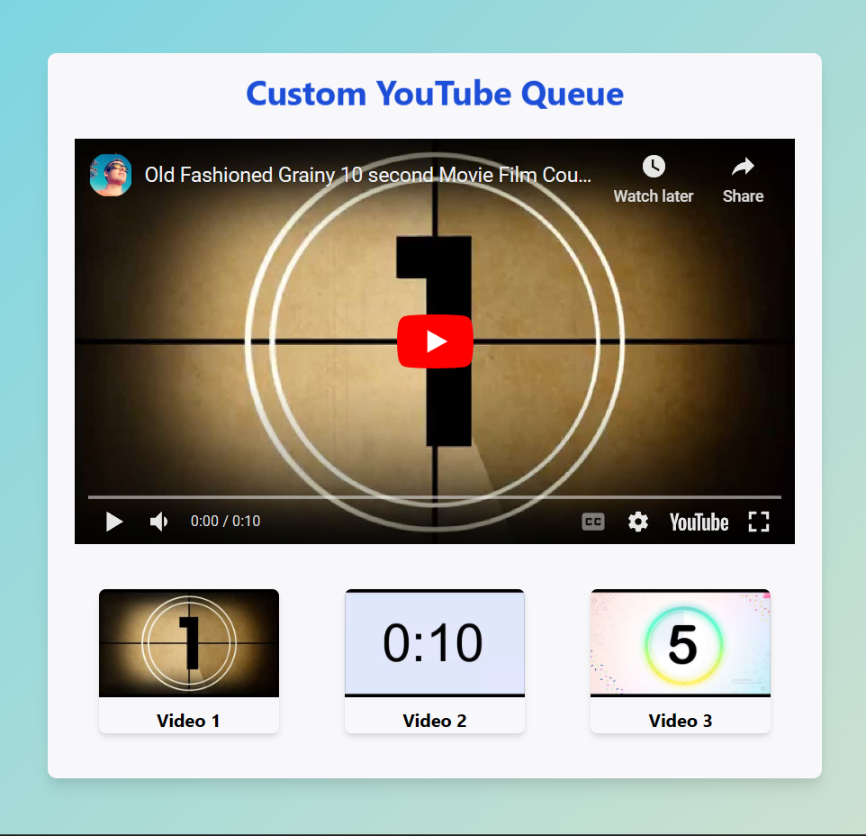

# YouTube Infinite Queue

YouTube Infinite Queue is a custom video playlist application that allows you to create and manage a personalized video queue using the YouTube API. Play your favorite videos seamlessly in a loop, and enjoy a continuous stream of entertainment. Easily add and arrange videos in the queue, and watch them play one after the other. With an attractive and user-friendly interface, YouTube Infinite Queue offers a delightful way to enjoy your favorite YouTube videos endlessly.

## Features

- Create a custom video queue using YouTube videos
- Seamlessly play videos in an infinite loop
- Drag and drop videos to reorder the queue
- Click on any video thumbnail to play that video
- Automatically play the next video when the current one ends
- Attractive and user-friendly UI design

## How to Use

1. Clone the repository or download the source code.
2. Open `index.html` in your web browser.
3. Replace the `videoIds` array with the YouTube video IDs of your desired playlist.
4. Enjoy watching your custom YouTube Infinite Queue!

## Screenshots

## Author

[Talha G.](https://github.com/talhag3)

## License

This project is licensed under the [MIT License](LICENSE).
